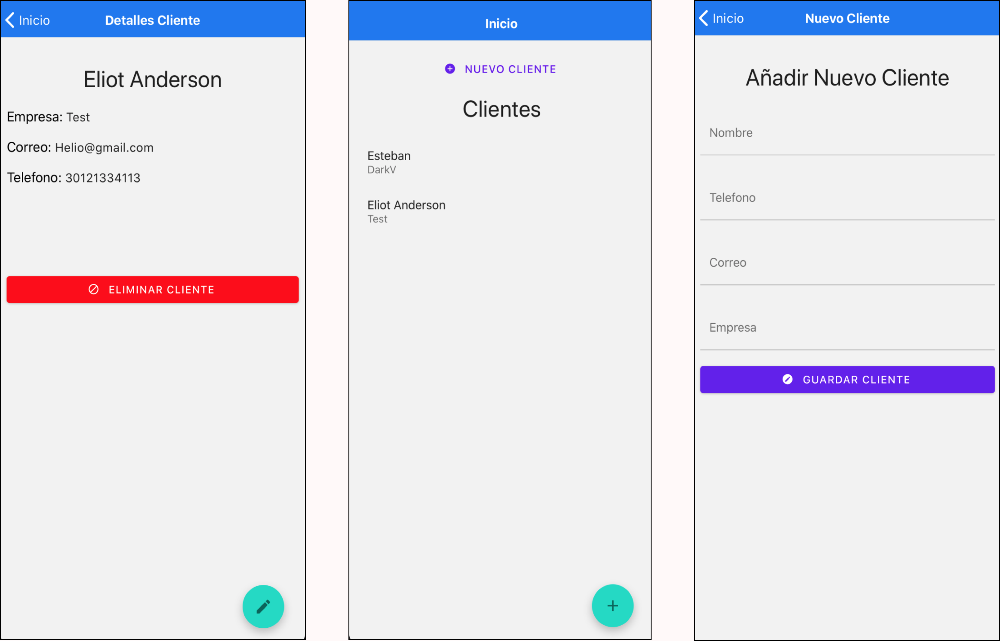

<p>


</p>

# Screenshots


## Descripción
CRUD de Clientes con [JSON-SERVER](https://github.com/typicode/json-server)
##
**CRUD** es el acrónimo de "Crear, Leer, Actualizar y Borrar" 

## Desarrollo Local
### Pre-requisitos

Tener instalado Xcode y Android Studios

#### 1. Instalar los paquetes 
```bash
    npm install 
```

#### 2.1 Paso adicional para iOS
```bash
    cd ios && pod install
```

#### 3. Instalar Json-Server
[JSON-SERVER](https://github.com/typicode/json-server)
```bash
    npm install -g json-server
```

#### 4. Inicie el servidor JSON
```bash
    json-server db.json
```

#### 5 Inicie la aplicación en modo de desarrollo
```bash
    npx react-native run-ios
    or
    npx react-native run-android
```

